# DSO101_Assignments_1_SS2026 : Todo-list App Deployment with CI/CD

## Introduction
This report documents the completion of Assignment 1 for the module DSO101 (Continuous Integration and Continuous Deployment). The assignment demonstrates the implementation of a full-stack **Todo-list Web Application** integrated with modern DevOps practices including:

- Docker containerization  
- Docker Hub image publishing  
- Deployment using Render  
- Automated build & deployment using Git integration  

The project is divided into two main parts:
- **Part A:** Deploying a pre-built docker image to docker hub registry  
- **Part B:** Automated image build and deployment 

## Step 0: Simple Full-stack Web Application
A simple todo-list web application was developed.

### Tech Stack Used
- **Frontend** : React.js  
- **Backend**  : Node.js + Express
- **Database** : PostgreSQL 
- **DevOps**   : Docker, Render 

### Application Features

- Add tasks  
- Edit tasks  
- Delete tasks  
- Persistent storage using database  
- RESTful API for CRUD operations  

### Environment Variables

#### Backend (.env)
- DB_HOST = your_db_host  
- DB_USER = your_db_user  
- DB_PASSWORD = your_db_password  
- PORT = 5000

#### Frontend (.env)
REACT_APP_API_URL=[http://localhost:5000/](http://localhost:5000/)

**Important:** `.env` files are added to `.gitignore` and not committed to GitHub.

## Part A: Deploying a pre-built docker image to docker hub registry
Dockerfiles created for both frontend and backend. Images tagged using student ID.

### Backend Dockerfile
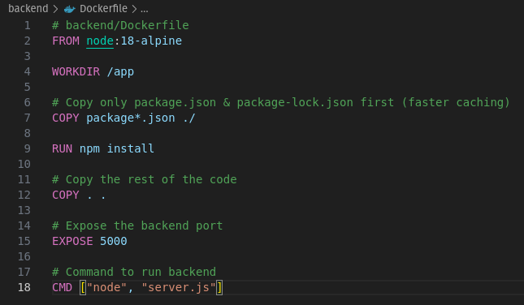

### Frontend Dcokerfile
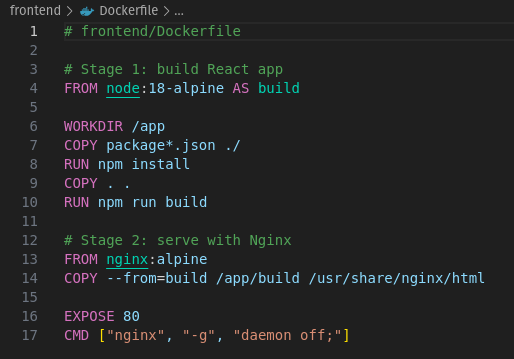

### Build Docker Image
#### Backend 
```bash
docker build -t pulu18/be-todo:02230310 .
```
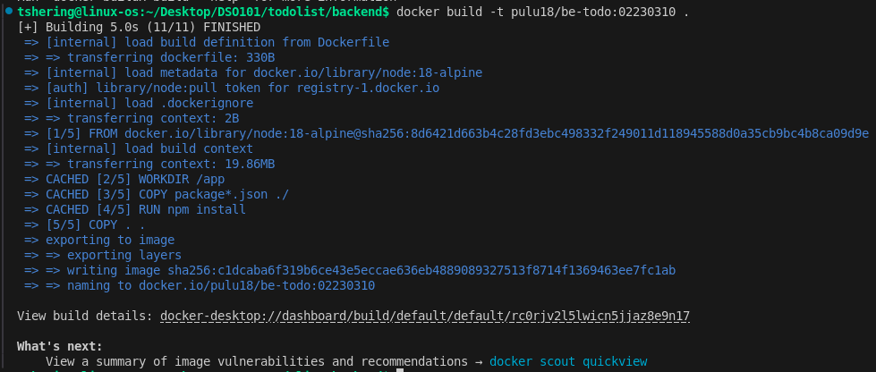

#### Frontend
```bash
docker build -t pulu18/fe-todo:02230310 .
```
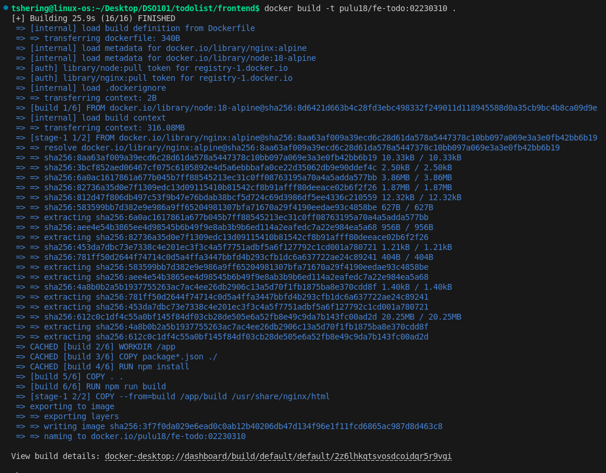

### Push to Docker Hub
#### Backend
```bash
docker login
docker push pulu18/be-todo:02230310
```
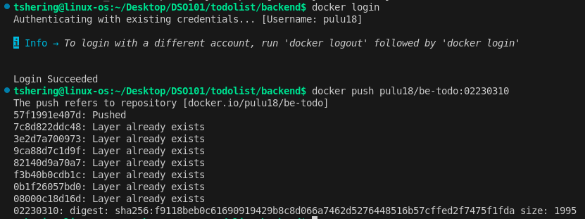

#### Frontend
```bash
docker login
docker push pulu18/fe-todo:02230310
```
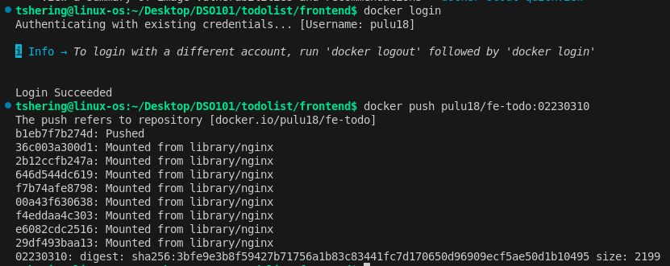

### Deploying on Render
#### Backend Web service
- Create a Web Service and then select "Existing image from Docker Hub".
- Image: `pulu18/be-todo:02230310`  
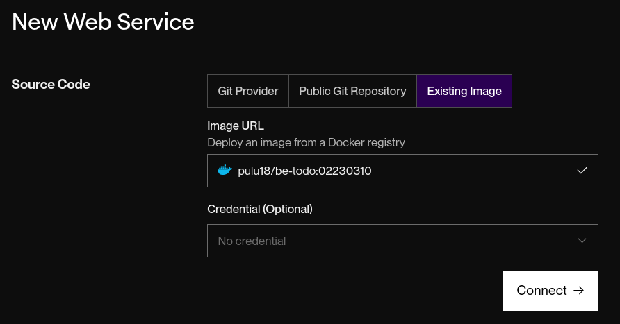

#### Create a Postgres database on render
Click on New and then Postgres  
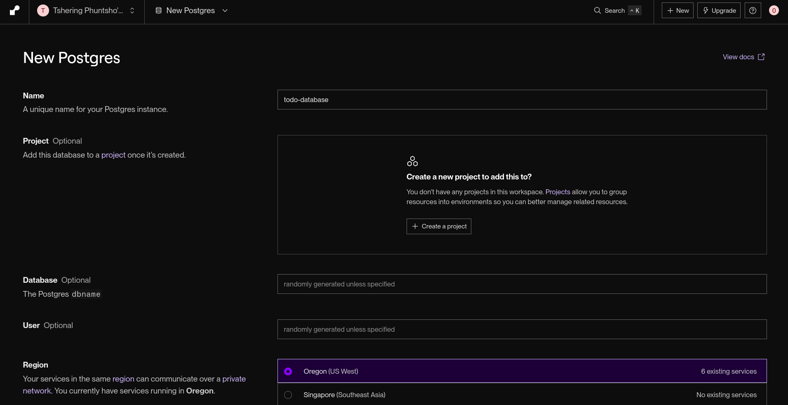

Once the Render DB is ready, add those connections in the backend web service environment variables.  
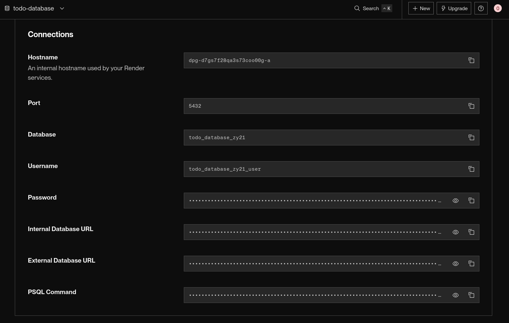

#### Environment Variables


Now backend is live  
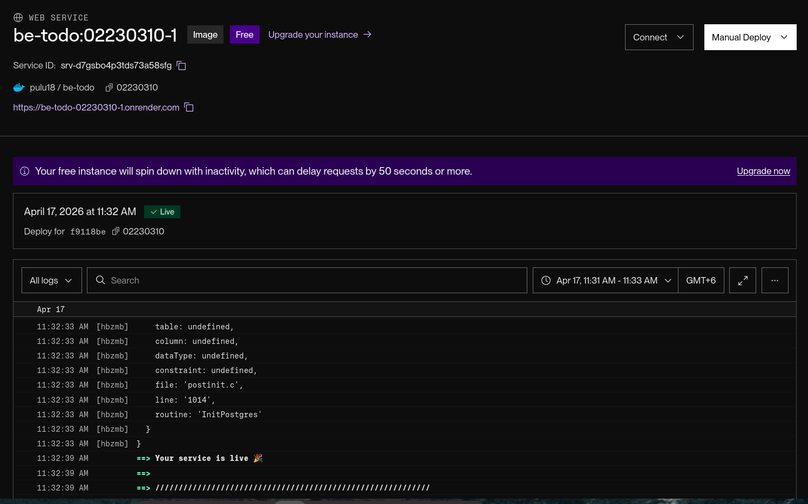

#### Frontend Web service
- Create a Web Service and then select "Existing image from Docker Hub".
- Image: `pulu18/fe-todo:02230310`  
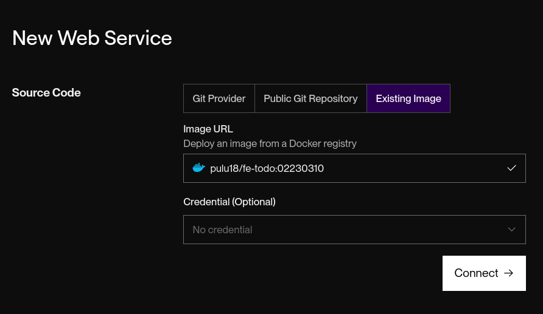

Set the environment variable to live backend url.  
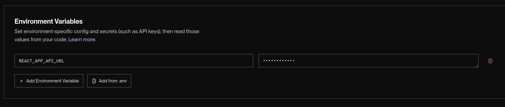

Now frontend is also live  
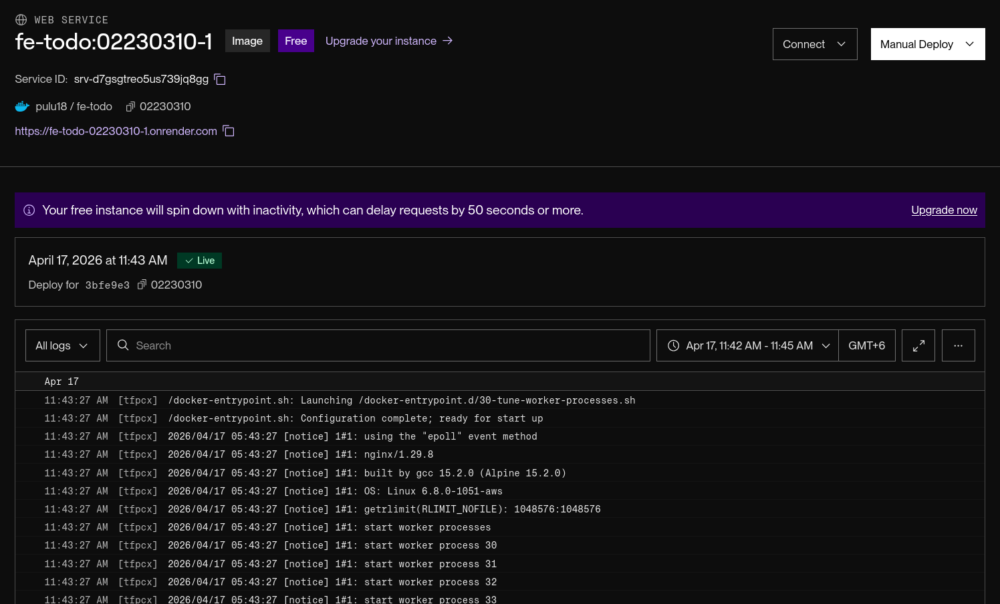

### Live Frontend Screenshots
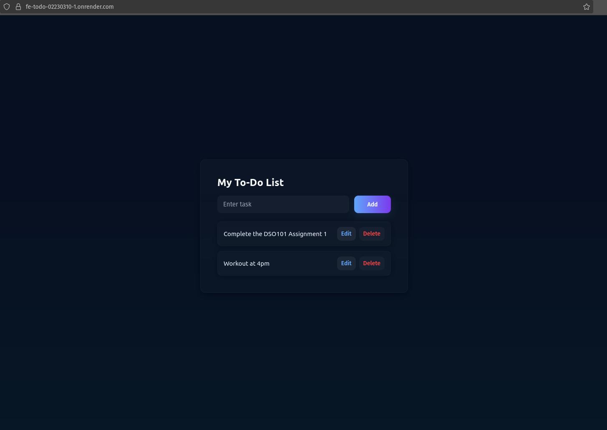

## Part B: Automated image build and deployment

### Project Structure  
```
todo-app/
    │
    ├── backend/
    │   ├── Dockerfile
    │   ├── server.js
    │   └── .env.production
    │
    ├── frontend/
    │   └── Dockerfile
    │   ├── .env.production
    │   └── src/
    │       ├── App.js
    │       └──index.js
    │        
    ├── README.md
    │
    └── render.yaml
```

### Yaml file Configuration
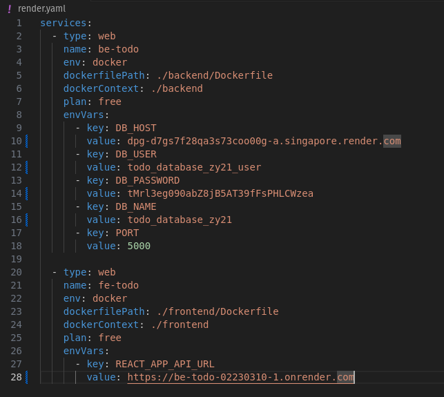

### Blueprint
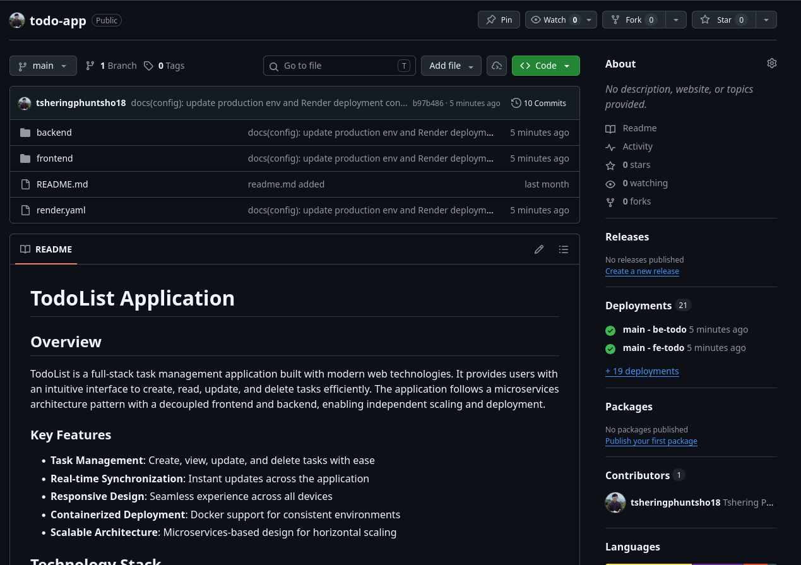

## CI/CD Workflow
1. Code pushed to GitHub
2. Render detects changes automatically
3. New Docker images are built
4. Services are redeployed automatically

## Conclusion
This assignment successfully demonstrates the deployment of a full-stack application using modern DevOps tools. The transition from manual deployment to automated CI/CD highlights the efficiency and scalability of continuous deployment systems in real-world applications.

## Links
**Todo-list github repo link** : https://github.com/tsheringphuntsho18/todo-app

**App link** : https://fe-todo-02230310-1.onrender.com/
