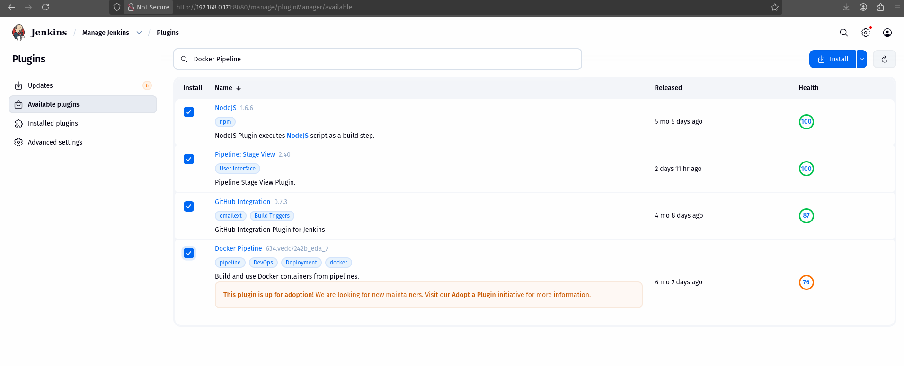
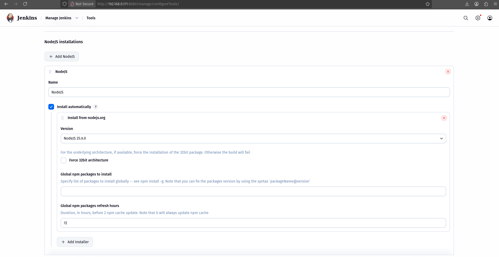
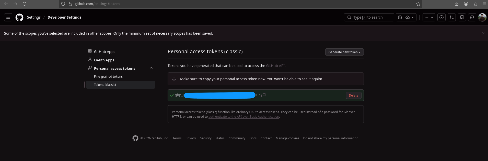
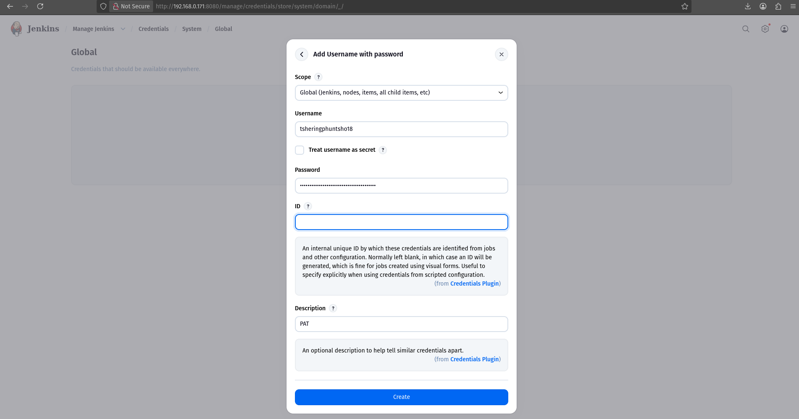
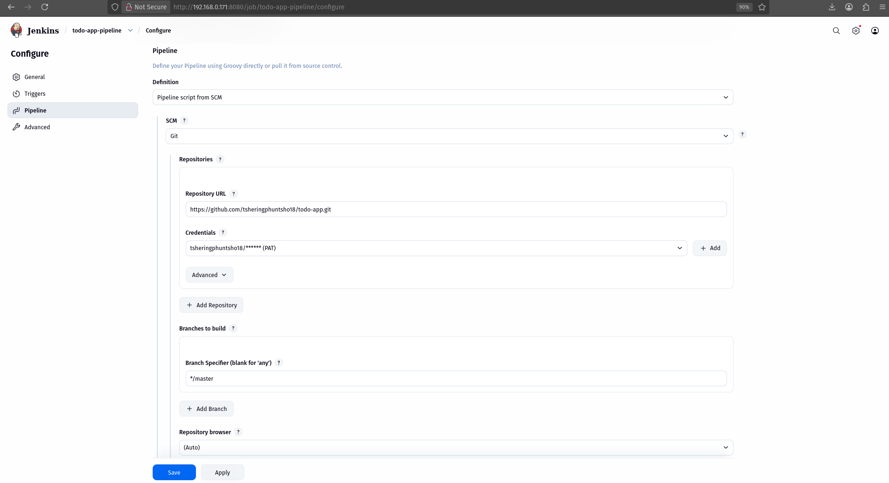

# DSO101_Assignments_2_SS2026 : CI/CD pipeline using Jenkins

## Objective

The objective of this assignment is to implement a Continuous Integration and Continuous Deployment (CI/CD) pipeline using Jenkins for a Node.js Todo-list application from assignment 1. The pipeline automates code integration, testing and deployment processes.

## Tools & Technologies Used

* **Jenkins** (CI/CD Automation)
* **GitHub** (Version Control)
* **Node.js & npm** (Runtime & Package Manager)
* **Jest** (Testing Framework)
* **Docker** (Containerization)

## Task 1: Jenkins Setup for Node.js
- Installed Jenkins.
- Installed necessary Jenkins plugins to support Node-based pipelines and GitHub integration.
- Configured the Node.js tool in Jenkins Tools so pipeline jobs can use the selected Node LTS and its package manager(s).

<div align="center"><i>figure 1: Installation of required plugins</i></div> 

<div align="center"><i>figure 2: Node.js tool configuration</i></div>

## Task 2: GitHub Repository Setup
- The Todo-list application was pushed to a GitHub repository.

- A GitHub Personal Access Token (PAT) was created and stored securely:
    - GitHub → Settings → Developer settings → Personal access tokens (classic) → Generate new token.
    - Scopes granted: repo and admin:repo_hook.  

<div align="center"><i>figure 3: Personal Access Token(PAT)</i></div>

- The PAT was added to Jenkins credential store:
    - Jenkins → Manage Jenkins → Manage Credentials → (global) → Add Credentials.
    - Kind: Username with password
        - Username: my github username
        - Password: my github PAT
        - ID/Description: optional  

<div align="center"><i>figure 4: GitHub Credentials in Jenkins</i></div>

## Task 3: Jenkinsfile for Node.js Pipeline
Added Jenkinsfile in the root directory.
```Jenkins
pipeline {
    agent any

    tools {
        nodejs 'NodeJS'
    }

    stages {

        stage('Checkout') {
            steps {
                git branch: 'main', 
                url: 'https://github.com/tsheringphuntsho18/todo-app.git'
            }
        }

        stage('Install') {
            steps {
                sh 'npm install'
            }
        }

        stage('Build') {
            steps {
                sh 'npm run build || echo "No build step"'
            }
        }

        stage('Test') {
            steps {
                sh 'npm test'
            }
            post {
                always {
                    junit 'junit.xml'
                }
            }
        }

        stage('Deploy') {
            steps {
                script {
                    docker.build('pulu18/node-app:latest')
                    
                    docker.withRegistry('https://registry.hub.docker.com', 'docker-hub-creds') {
                        docker.image('pulu18/node-app:latest').push()
                    }
                }
            }
        }
    }
}
```

## Task 4: Run the Pipeline
1. In Jenkins created a New Item
    1. Name: todo-app-pipeline
    2. Type: Pipeline → OK

2. Configure the pipeline
    - Pipeline > Definition: Pipeline script from SCM  
    - SCM: Git  
    - Repository URL: https://github.com/tsheringphuntsho18/todo-app.git  
    - Credentials: select the GitHub PAT stored in Jenkins  
    - Branch Specifier: main  
    - Script Path: Jenkinsfile

<div align="center"><i>figure 5: Jenkins pipeline configuration </i></div>

## Pipeline Configuration

The Jenkins pipeline was configured using a `Jenkinsfile` stored in the root of the GitHub repository. The pipeline consists of the following stages:

### 1. Code Checkout

The pipeline pulls the latest source code from the GitHub repository.

### 2. Dependency Installation

All required dependencies are installed using:

```
npm install
```

### 3. Build Stage

The application is built using:

```
npm run build
```

### 4. Testing Stage

Unit tests are executed using Jest:

```
npm test
```

JUnit reports are generated and published in Jenkins.

### 5. Deployment Stage

The application is containerized using Docker and pushed to Docker Hub.

## Pipeline Workflow

GitHub → Jenkins → Install → Build → Test → Deploy

## Challenges Faced

1. **Jenkins Setup Issues**
   Initial configuration required troubleshooting of plugins and environment setup.

2. **Docker Permission Errors**
   Jenkins user lacked permission to run Docker commands, which was resolved by adding Jenkins to the Docker group.

3. **Test Failures**
   Some test cases failed initially due to configuration issues in Jest.

## Conclusion

The CI/CD pipeline was successfully implemented using Jenkins. This automation improves development efficiency by ensuring continuous integration, automated testing and seamless deployment.

## Links

* GitHub Repository: https://github.com/tsheringphuntsho18/todo-app
