# DSO101_Assignments_3_SS2026 : Todo-list App CI/CD deployment with Github Action

## Aim

The aim of this assignment is to automate the build, containerization and deployment process of a todolist application using GitHub Actions, Docker, DockerHub and Render.

## Objective

The objective of this assignment is to configure a GitHub Actions workflow to automate:   
1. Building a Docker container for todolist application.
2. Pushing the container to DockerHub.
3. Deploying the container on Render.com.  

***Note***: For this assignment 3, I am using the todolist application from Assignment 1.

## Tools and Technologies Used

- GitHub
- GitHub Actions
- Docker
- DockerHub
- Render

## Steps Taken

### 1. Verify github repository setup

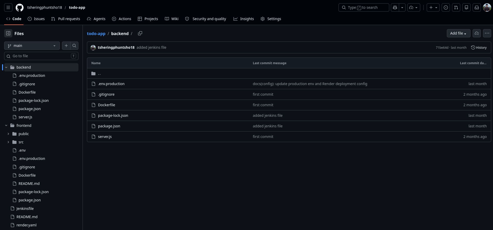  

The github repository of the todolist app has package.json file in both frontend and backend, containing relevant script.  
The repository is public.

### 2. Verify the Dockerfiles.

There are 2 Dockerfile, one for frontend and the another one for backend.  

#### Backend Dockerfile

It is inside `backend/Dockerfile`

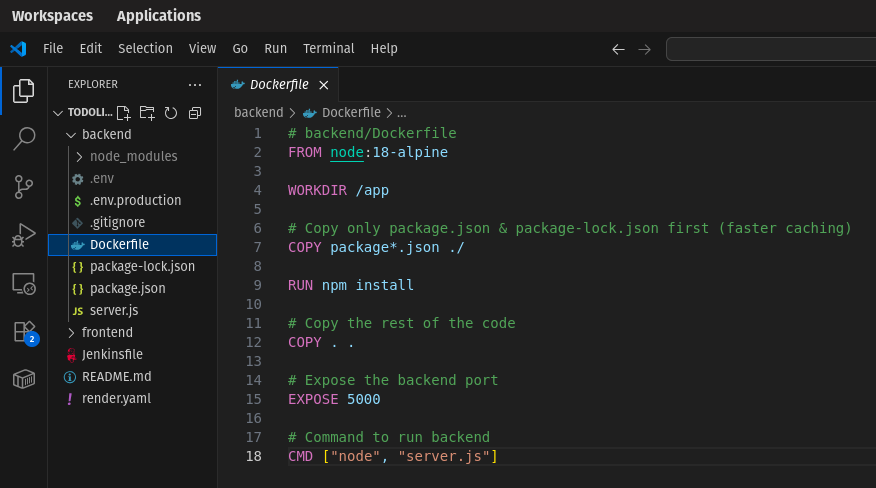  

#### Frontend Dockerfile

It is inside `frontend/Dockerfile`

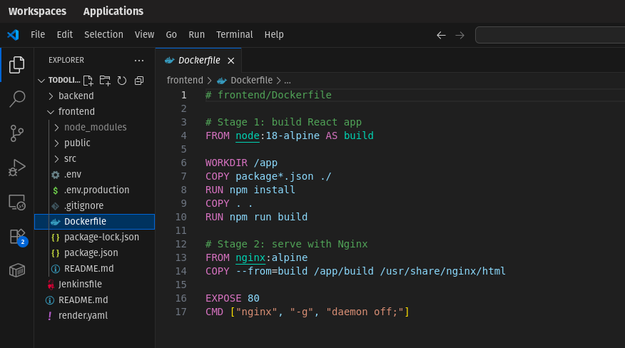  

### 3. Test locally 

#### Build Backend  

```docker 
docker build -t todo-backend ./backend
```

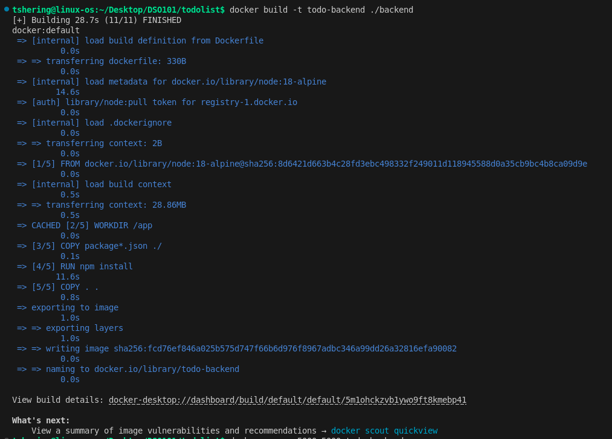

#### Run

```docker
docker run -p 5000:5000 todo-backend
```  

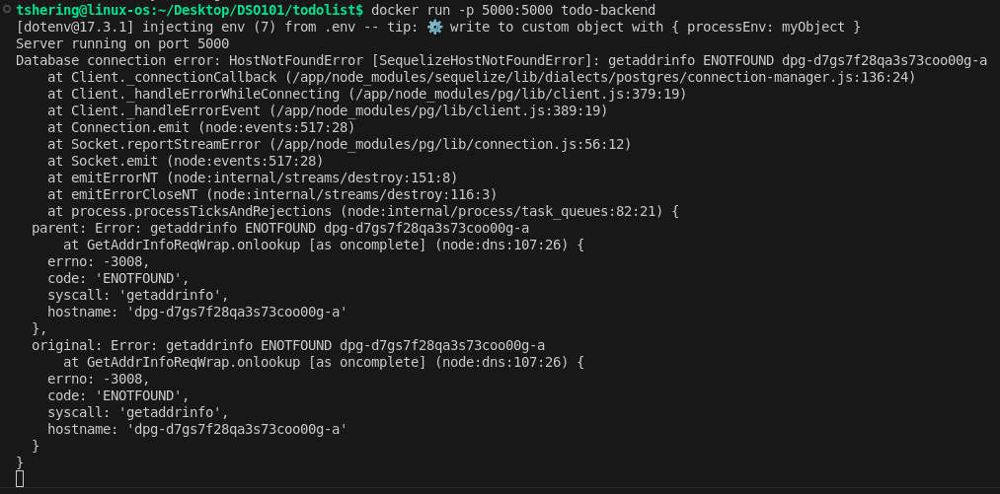

#### Build Frontend  

```docker 
docker build -t todo-frontend ./frontend
```

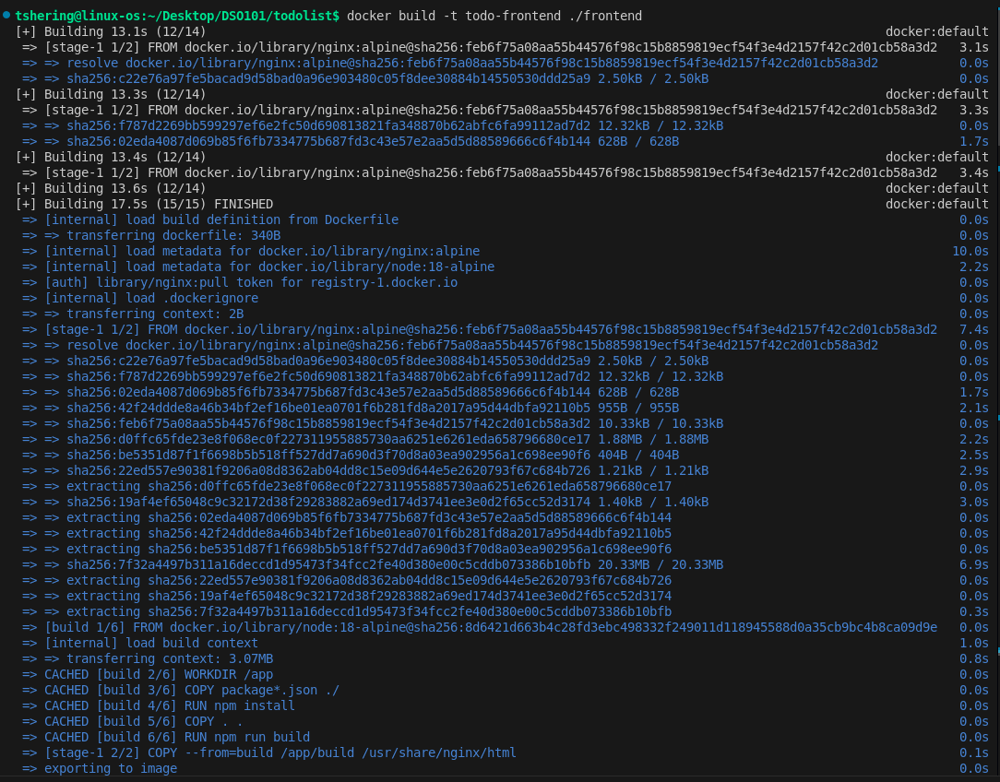

#### Run

```docker
docker run -p 3000:80 todo-frontend
```  

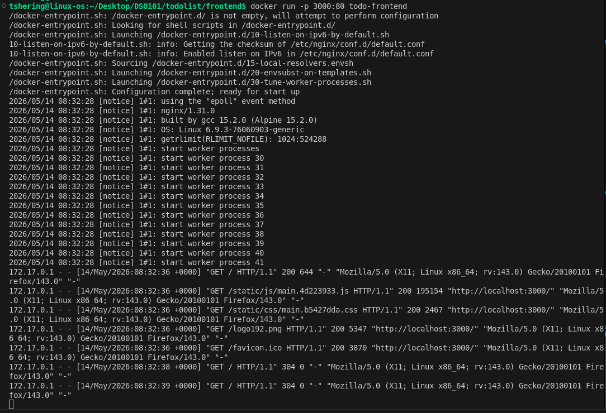


#### Live App
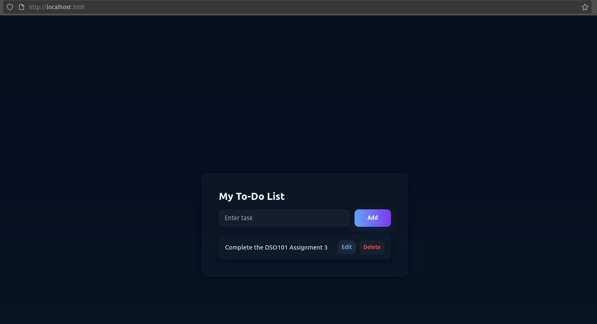

### 4. Create DockerHub Repositories

Created 2 public repositories:

1. Backend image

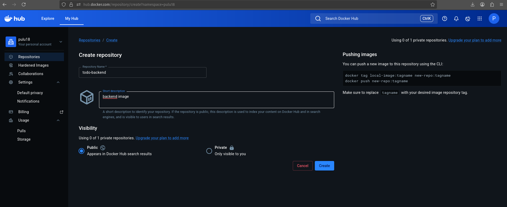

2. Frontend image

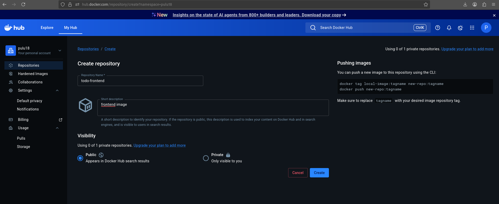

### 5. Create DockerHub Access Token

In dockerhub, go to Account settings and then Personal access tokens.

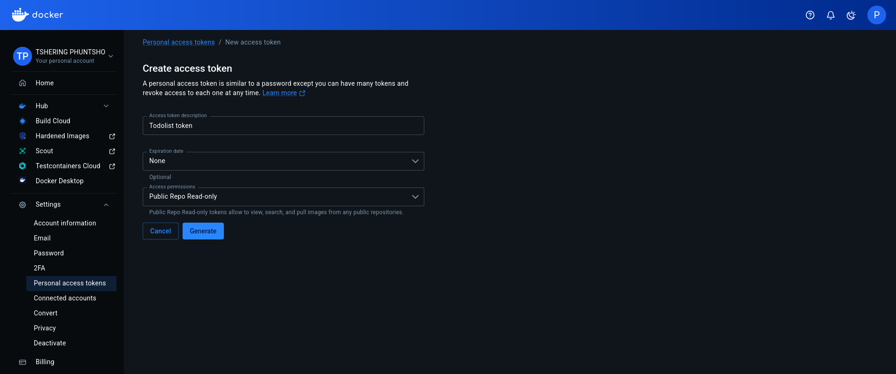

### 6. Add GitHub Secrets

In GitHub repo, go to Settings → Secrets and Variables → Actions. Add the following:  

| Secret               | Value                   |
| -------------------- | ----------------------- |
| DOCKERHUB_USERNAME   | your username           |
| DOCKERHUB_TOKEN      | docker token            |
| FRONTEND_RENDER_HOOK | frontend deploy webhook |
| BACKEND_RENDER_HOOK  | backend deploy webhook  |


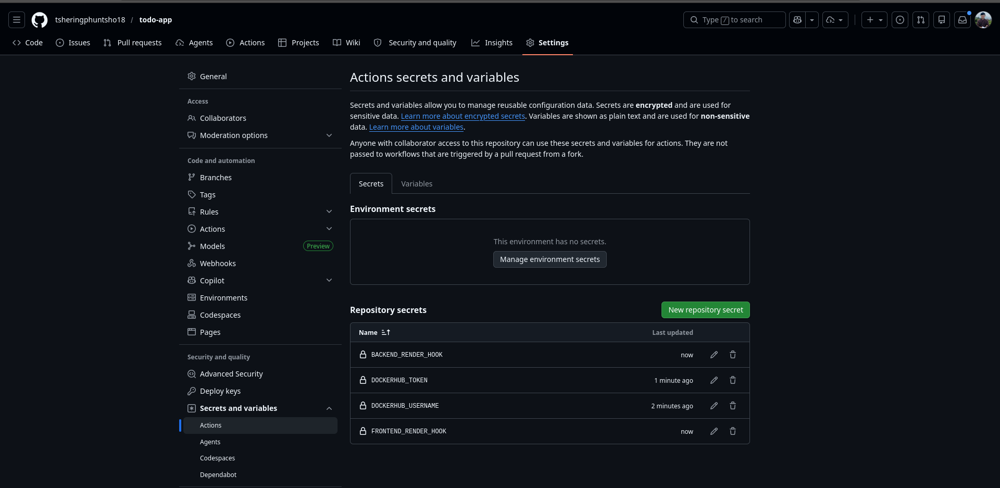

### 7. Create GitHub Actions Workflow

Created `.github/workflows/deploy.yml` to automate:
- Docker login
- Build and push for backend and frontend
- Webhook deployment to Render

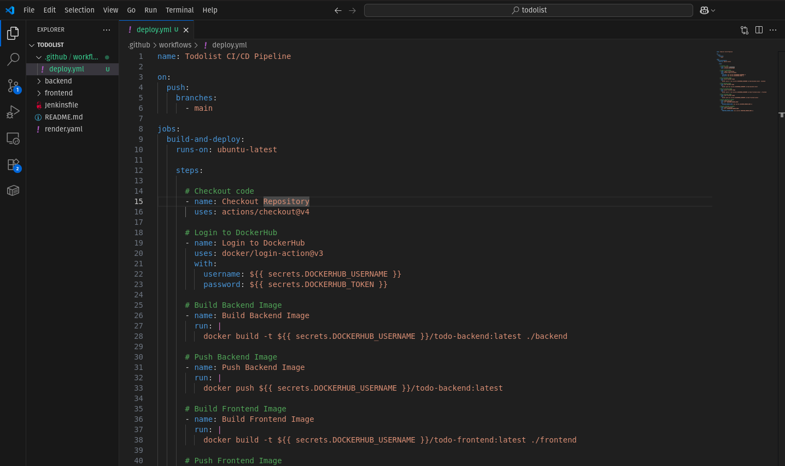

### 8. Deploy Backend and Frontend On Render

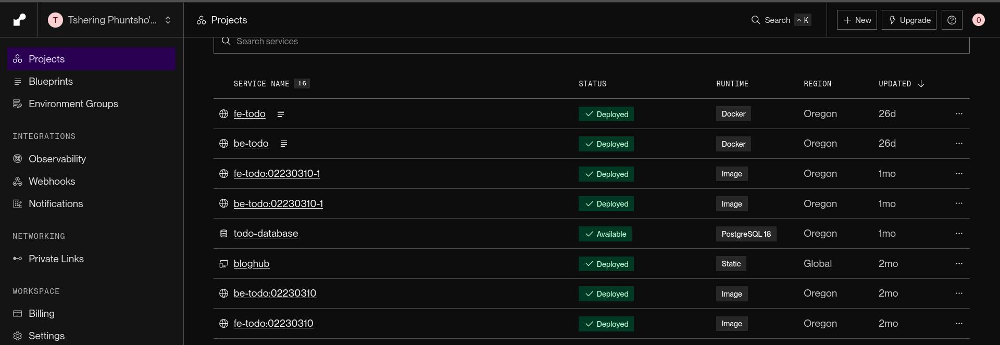

### 11. Push the code

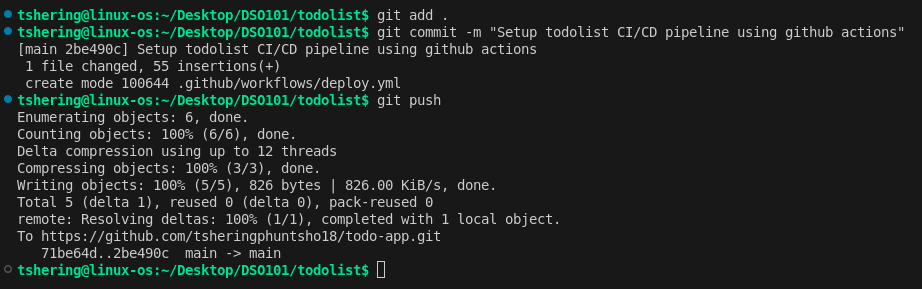

#### What Happens Automatically

GitHub Actions will:

- build backend image
- push backend image
- build frontend image
- push frontend image
- redeploy backend on Render
- redeploy frontend on Render

### GitHub Actions Success

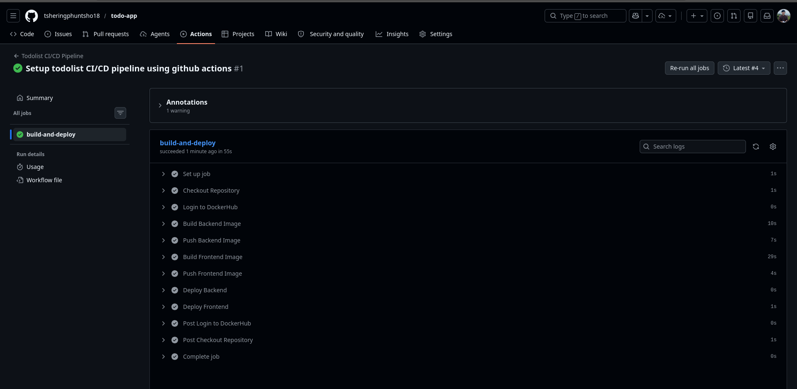

Show green successful workflow.

### Render Deployments

Verified that it deployed via Deploy Hook

#### Frontend


#### Backend

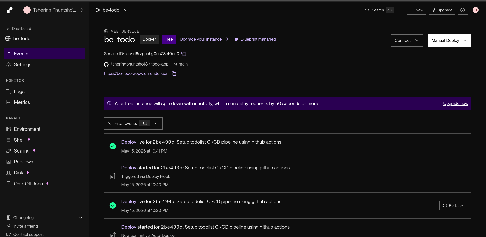


## Challenges Faced

#### DockerHub login failure in GitHub Actions

I encountered an error during the DockerHub login step in GitHub Actions:

`Error: Username and password required`

The issue occurred because I accidentally added the secrets under Secrets and variables → Codespaces instead of → Actions. After moving the secrets to Actions scope, the login worked as expected.

## Learning Outcomes

Through this assignment, I learned:
- How CI/CD pipelines work.
- How to automate deployments using GitHub Actions.
- How Docker containerization works.
- How to deploy cloud applications using Render.

## Links

GitHub Repo Link: https://github.com/tsheringphuntsho18/todo-app

Live APP URL: https://fe-todo-8rx5.onrender.com/