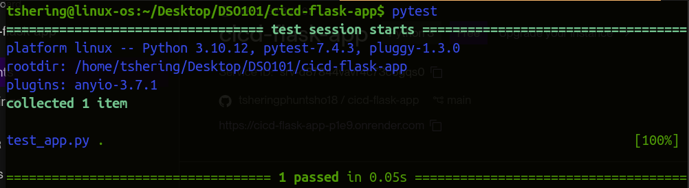
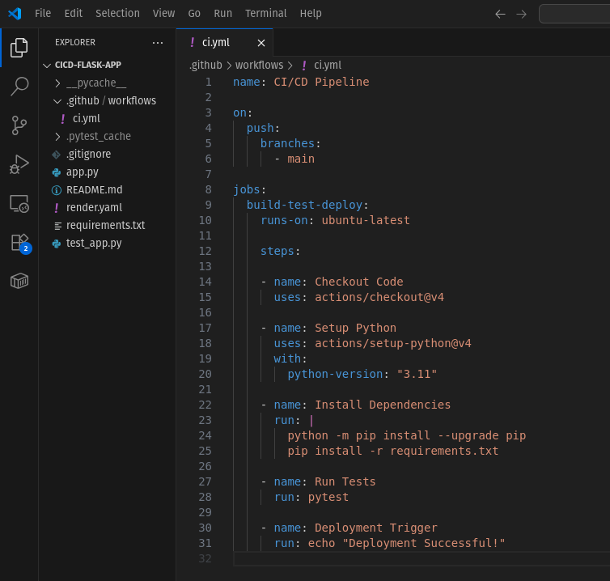
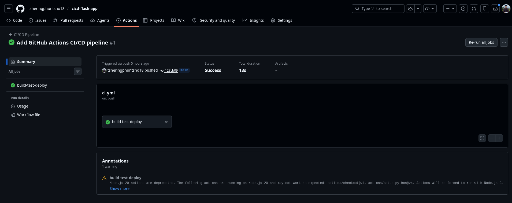
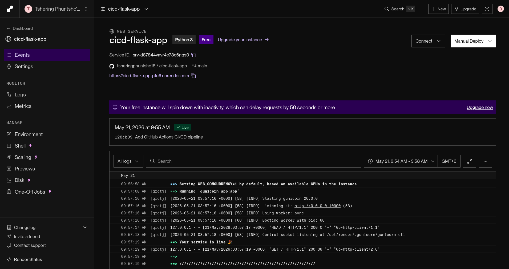

# DSO101_Assignments_4_SS2026 : CI/CD Pipeline with Testing and Deployment

## Objective

This project demonstrates a complete CI/CD pipeline using:
- Flask
- Pytest
- GitHub Actions
- Render Deployment

## Technologies Used

- Python
- Flask
- Pytest
- GitHub Actions
- Render
- Gunicorn

## Project Structure

```txt
cicd-flask-app/
│── app.py
│── test_app.py
│── requirements.txt
│── render.yaml
│── .github/workflows/ci.yml
│── README.md
```

## Running Locally

### Install Dependencies

```bash
pip install -r requirements.txt
```

### Run Application

```bash
python app.py
```

### Run Tests

```bash
pytest
```

## CI/CD Workflow

The GitHub Actions workflow performs:

1. Checkout repository
2. Setup Python environment
3. Install dependencies
4. Run unit tests
5. Trigger deployment

## Deployment

The application is deployed automatically using Render.

Every push to the `main` branch:
- Runs tests
- Builds the application
- Automatically deploys to Render

## Screenshots

1. Test Output



2. Github Workflow




3. Github Actions 



4. Render Deployment



## Github 

https://github.com/tsheringphuntsho18/cicd-flask-app


## Live Application

https://cicd-flask-app-p1e9.onrender.com